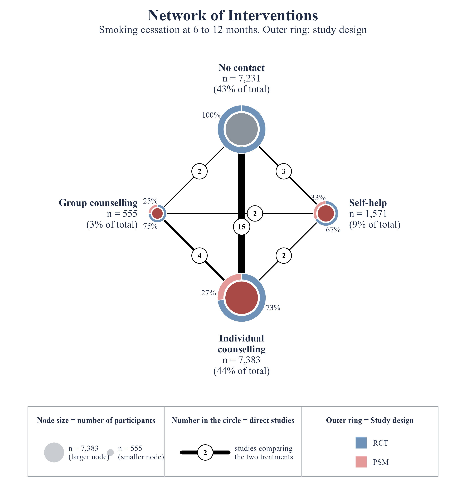

# nmaplots

Publication-quality network plots for `netmeta` objects, in one function.

`nmaplot()` takes the object returned by `netmeta::netmeta()`, exactly like
`netmeta::netgraph()`, and draws the evidence network with ggplot2: node
area by sample size, black edges with the number of studies in a circle,
treatment name plus `n = 1,234 (18% of total)` at every node, an optional outer ring per
node showing a subgroup composition (study design, risk of bias, region,
anything), and a framed legend panel.



## Installation

```r
# install.packages("remotes")
remotes::install_github("vanioljantunes/nmaplots")
```

Requires R >= 4.1 and ggplot2 >= 3.5. `netmeta` is needed to build the
object you plot. `ragg` is optional (sharper PNG and TIFF output).

## Quick start

```r
library(netmeta)
library(nmaplots)

data(Franchini2012)
p1 <- pairwise(list(Treatment1, Treatment2, Treatment3),
               n = list(n1, n2, n3), mean = list(y1, y2, y3),
               sd = list(sd1, sd2, sd3), data = Franchini2012, studlab = Study)
net1 <- netmeta(p1, sm = "MD", reference.group = "plac")

# Same input as netgraph(net1). Title is centred; the outcome becomes the subtitle.
nmaplot(net1, outcome = "Change in UPDRS motor score")

# Outer ring: any subgroup composition, one row per treatment and group
design <- data.frame(treatment = rep(net1$trts, each = 2),
                     group = rep(c("RCT", "PSM"), 5),
                     value = c(4, 2,  3, 2,  2, 1,  3, 0,  2, 2))
nmaplot(net1, ring = design, ring_name = "Study design",
        outcome = "Change in UPDRS motor score")

# Save as PNG, PDF or TIFF (format from the extension)
nmaplot(net1, ring = design, ring_name = "Study design",
        outcome = "Change in UPDRS motor score",
        file = c("network.png", "network.pdf", "network.tiff"),
        width = 9, height = 9.5, dpi = 300)
```

## What you can change

| Feature | Argument(s) |
|---|---|
| Outcome and ring names | `outcome` (subtitle), `ring_name` (subtitle + legend) |
| Subgroup ring around nodes | `ring` (long data frame treatment/group/value, or wide matrix), `ring_colors`, `ring_width`, `ring_labels`, `ring_title` |
| Boxed legend below the network | on by default; `legend = FALSE` removes it, `legend_size` |
| Fonts | `font_family = "serif"` (default) or `"sans"` |
| Title, subtitle, caption | `title`, `subtitle`, `caption`, `title_size`, `title_color`, `title_align` |
| Background grid on/off | `grid = TRUE`, `grid_color` |
| Node arrangement | `layout = "multi"` (polygon, default), `"circle"` (on a circle, ordered by number of comparisons), `"star"` (reference in the centre), or a coordinate matrix; `order`; `reference` |
| Number of studies on each connection | circled count, `edge_labels = TRUE` (default), `edge_label_size`, `edge_label_fill` (`NA` = plain text) |
| One line per study between two nodes | `edge_style = "multi"`, `max_lines` |
| Hide weakly connected comparisons | `min_studies` |
| Sample size and share of total under each name | `show_n = TRUE` (default); falls back to number of studies `k = ...` when the object has no sample sizes |
| Colours | `node_fill` (single colour, one per treatment, or `"auto"` + `palette`), `reference_fill` (grey reference node), `node_color`, `edge_color`, `highlight` + `highlight_color`, `background`, `label_color` |
| Node size | `node_size = "n" / "studies" / "equal"` or numeric, `node_size_range` |
| Edge width | `edge_width = "studies" / "equal"` or numeric, `edge_width_range` |
| Multi-arm study shading | `multiarm`, `multiarm_fill`, `multiarm_alpha` |
| Labels | `labels` (display names), `label_wrap`, `label_size`, `label_position = "outside" / "center"`, `label_offset` |
| Export | `file`, `width`, `height`, `dpi` |

`netgraph()` arguments `col.points`, `col`, `number.of.studies`, `cex`,
`cex.points`, `seq`, `start.layout`, `thickness`, `points.min`, `points.max`
and `labels` are accepted and mapped to the equivalents above, so existing
calls keep working.

The function returns a `ggplot` object. Add layers or a different theme with
`+` as usual. The node and edge data frames used for drawing are stored in
`p$nmaplot`.

## Gallery

Default look (smoking cessation, netmeta example data):


With a study-design ring (RCT versus propensity-score matched):


`layout = "circle"` places the treatments on a circle (light guide line)
ordered by number of comparisons, most connected at the top;
`layout = "star"` puts the reference in the centre. `edge_style = "multi"` draws one line per study and `min_studies`
hides thin comparisons. The script that produces the
figures is `inst/examples/demo.R`.

## Test notebook

`inst/examples/nmaplot_netmeta.Rmd`: load packages, `data(Franchini2012)`
(the netmeta vignette example), fit `netmeta()`, plot with `nmaplot()`,
save to PNG/PDF/TIFF, then a few layout variants.

## Origin

The defaults come from the MetaHub MetaRank 3, Domain 5 network
meta-analysis template (`frequentist.Rmd`), whose `netgraph()` call used
`plastic = FALSE`, `points = TRUE`, `col.points = "darkblue"`,
`number.of.studies = TRUE`, `thickness = "number.of.studies"` and labels
`paste0(trts, " (n=", n.trts, ")")`, and wrote each figure to PNG and PDF.

## License

MIT. See `LICENSE.md`.
