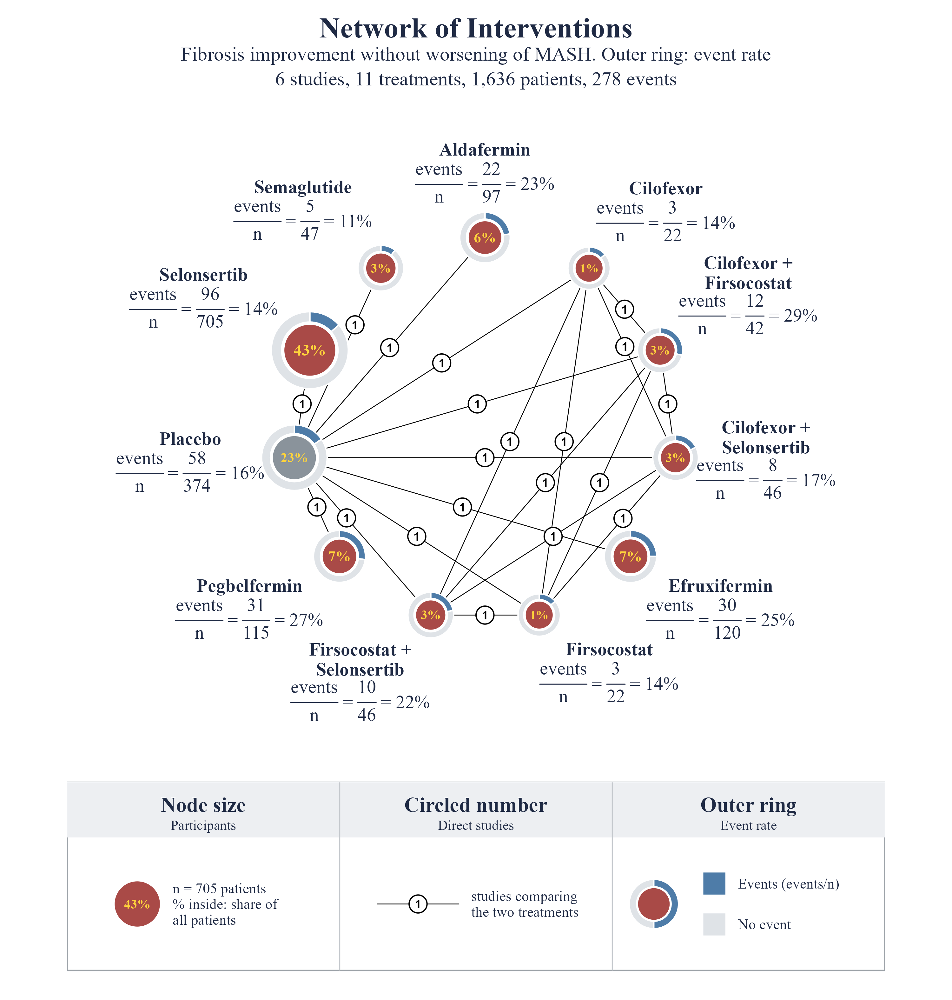

# nmaplots

Publication-quality network plots for `netmeta` and `gemtc` objects, in one
function.

`nmaplot()` takes the object returned by `netmeta::netmeta()`, exactly like
`netmeta::netgraph()`, or a `gemtc` network, model or result, and draws the
evidence network with ggplot2: node area by sample size, black edges with the
number of studies in a circle, treatment name plus `n = 1,234 (18%)` at every
node, an outer ring with each treatment's event rate on binary networks, and a
framed legend panel.



## Installation

```r
# install.packages("remotes")
remotes::install_github("vanioljantunes/nmaplots")
```

Requires R >= 4.1 and ggplot2 >= 3.5. `netmeta` or `gemtc` is needed to
build the object you plot. `ragg` is optional (sharper PNG and TIFF output).

## Quick start

```r
library(netmeta)
library(nmaplots)

data(mash)
d <- mash$fib_improvement_alldoses
p <- pairwise(treat = treatment, event = responders, n = sampleSize,
              studlab = study, data = d, sm = "RR")
net <- netmeta(p, reference.group = "Placebo")

# Same input as netgraph(net). Binary outcome, so each node gets an outer ring
# with its event rate (events over participants). Title is centred; the
# outcome becomes the subtitle.
nmaplot(net, outcome = "Fibrosis improvement without worsening of MASH")

# Save as PNG, PDF or TIFF (format from the extension)
nmaplot(net, outcome = "Fibrosis improvement without worsening of MASH",
        file = c("network.png", "network.pdf", "network.tiff"),
        width = 9, height = 9.5, dpi = 300)
```

### gemtc

```r
library(gemtc)

# gemtc ids allow only letters, digits and underscore; keep the real names in
# `description` and nmaplot() uses them as labels
ids <- gsub("[^A-Za-z0-9_]", "_", d$treatment)
network <- mtc.network(
  data.ab = data.frame(study = d$study, treatment = ids,
                       responders = d$responders, sampleSize = d$sampleSize),
  treatments = unique(data.frame(id = ids, description = d$treatment)))

nmaplot(network, reference = "Placebo",
        outcome = "Fibrosis improvement without worsening of MASH")
# an mtc.model or the mtc.run() result works the same way
```

### Pairwise data with decimal commas

A `pairwise()` result saved with `write.csv2()` (or edited in a spreadsheet
set to a decimal-comma locale) reads back with `TE` and `seTE` as text, and
`netmeta()` stops with "Non-numeric value for argument 'TE'". `nma_clean()`
converts those columns, including Unicode minus signs; `nmaplot()` also takes
the pairwise rows directly and cleans them itself.

```r
f <- system.file("extdata", "recurrence_pairwise.csv", package = "nmaplots")
d <- read.csv(f, sep = ";", fileEncoding = "UTF-8")
class(d$TE)                                # "character": "-0,684"

nmaplot(d, outcome = "Patient recurrence")  # straight from the pairwise rows

d <- nma_clean(d)                           # TE, seTE now numeric
net <- netmeta(TE, seTE, treat1, treat2, studlab, data = d, sm = "RR",
               n1 = n1, n2 = n2, event1 = event1, event2 = event2)
nmaplot(net, outcome = "Patient recurrence")
```

`mash` is the built-in example: arm-level results of drug trials for MASH
with fibrosis, four outcomes (`?mash`).

The ring can show any subgroup composition instead of the event rate, such as
study design or risk of bias: pass a treatment-by-group table, for example
`ring = table(d$treatment, d$design)` with `ring_name = "Study design"`
(`mash`'s `design` column is illustrative). See `?nmaplots-2-ring`.

## What you can change

| Feature | Argument(s) |
|---|---|
| Outcome and ring names | `outcome` (subtitle), `ring_name` (subtitle + legend) |
| Event-rate ring on binary networks | drawn by default; `ring = FALSE` removes it |
| Subgroup ring around nodes | `ring` (long data frame treatment/group/value, or wide matrix), `ring_colors`, `ring_width`, `ring_labels`, `ring_title` |
| Boxed legend below the network | on by default; `legend = FALSE` removes it, `legend_size` |
| Fonts | `font_family = "serif"` (default) or `"sans"` |
| Title, subtitle, caption | `title`, `subtitle`, `caption`, `title_size`, `title_color`, `title_align` |
| Background grid on/off | `grid = TRUE`, `grid_color` |
| Node arrangement | `layout = "multi"` (polygon, default), `"circle"` (on a circle, ordered by number of comparisons), `"star"` (reference in the centre), or a coordinate matrix; `order`; `reference` |
| Number of studies on each connection | circled count, `edge_labels = TRUE` (default), `edge_label_size`, `edge_label_fill` (`NA` = plain text) |
| One line per study between two nodes | `edge_style = "multi"`, `max_lines` |
| Hide weakly connected comparisons | `min_studies` |
| Sample size and share of total under each name | `show_n = TRUE` (default); falls back to number of studies `k = ...` when the object has no sample sizes |
| Colours | `node_fill` (single colour, one per treatment, or `"auto"` + `palette`), `reference_fill` (grey reference node), `node_color`, `edge_color`, `highlight` + `highlight_color`, `background`, `label_color` |
| Node size | `node_size = "n" / "studies" / "equal"` or numeric, `node_size_range` |
| Edge width | `edge_width = "studies" / "equal"` or numeric, `edge_width_range` |
| Multi-arm study shading | `multiarm`, `multiarm_fill`, `multiarm_alpha` |
| Labels | `labels` (display names), `label_wrap`, `label_size`, `label_offset`, `label_box` (TRUE, FALSE or a fill colour) |
| Export | `file`, `width`, `height`, `dpi` |

`netgraph()` arguments `col.points`, `col`, `number.of.studies`, `cex`,
`cex.points`, `seq`, `start.layout`, `thickness`, `points.min`, `points.max`
and `labels` are accepted and mapped to the equivalents above, so existing
calls keep working.

The function returns a `ggplot` object. Add layers or a different theme with
`+` as usual. The node and edge data frames used for drawing are stored in
`p$nmaplot`.

## Gallery

The figure at the top is the default look (`mash`, fibrosis improvement):
a binary network, so the event-rate ring is on without any extra argument.

`layout = "circle"` places the treatments on a circle (light guide line)
ordered by number of comparisons, most connected at the top;
`layout = "star"` puts the reference in the centre. `edge_style = "multi"` draws one line per study and `min_studies`
hides thin comparisons. The script that produces the
figures is `inst/examples/demo.R`.

## Test notebook

`inst/examples/nmaplot_netmeta.Rmd`: load packages, `data(mash)`
(the netmeta vignette example), fit `netmeta()`, plot with `nmaplot()`,
save to PNG/PDF/TIFF, then a few layout variants.

## Origin

The defaults come from the MetaHub MetaRank 3, Domain 5 network
meta-analysis template (`frequentist.Rmd`), whose `netgraph()` call used
`plastic = FALSE`, `points = TRUE`, `col.points = "darkblue"`,
`number.of.studies = TRUE`, `thickness = "number.of.studies"` and labels
`paste0(trts, " (n=", n.trts, ")")`, and wrote each figure to PNG and PDF.

## License

MIT. See `LICENSE.md`.
